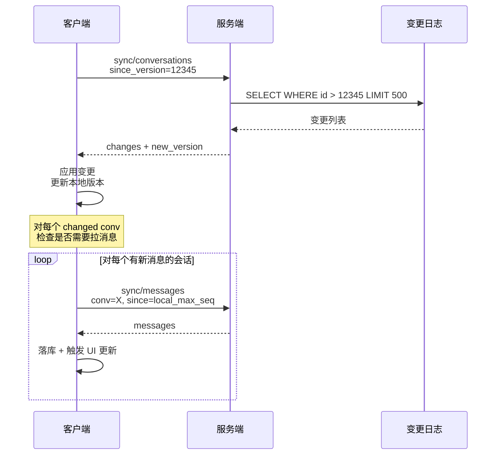
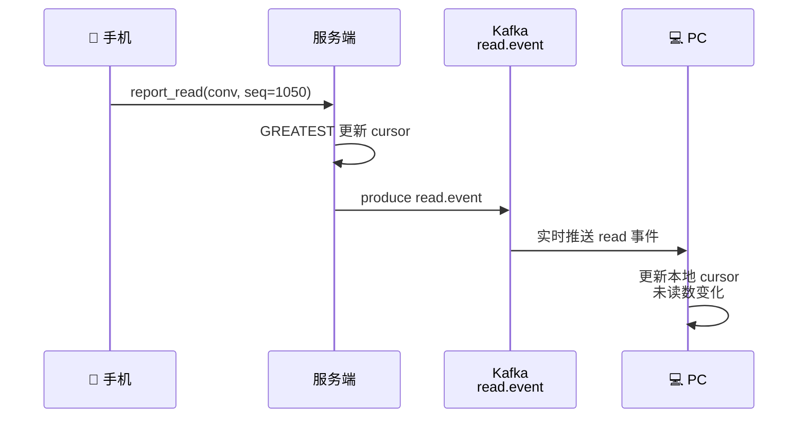

# 多设备消息同步详细方案 v1.0

> 适用：iOS / Android / PC / Web 多端同步  
> 目标：跨端一致、断点续传、不重不漏

---

## 目录

1. 设计目标
2. 同步模型
3. 增量同步协议
4. 全量同步与首次登录
5. 推拉协同
6. 冲突解决
7. 断点续传
8. 多端状态同步（已读/草稿）
9. 性能优化
10. 异常场景

---

# 1. 设计目标

| 指标 | 目标 |
|---|---|
| 跨端最终一致性 | 100% |
| 同步延迟（在线）| < 1s |
| 同步延迟（上线）| < 5s |
| 不重复消息 | 100% |
| 不丢消息 | 100% |
| 弱网可恢复 | ✅ |
| 历史漫游 | 按需 |

---

# 2. 同步模型

## 2.1 设备视角

每个设备维护自己的"已知世界"：

```
device_state {
  per_conv_max_seq:    Map<ConvId, Long>  // 已经收到的最大 seq
  per_conv_read_seq:   Map<ConvId, Long>
  global_sync_version: Long               // 跨会话同步水位
}
```

## 2.2 服务端视角

服务端是事实源：

```
ServerState {
  conv_max_seq:        Map<ConvId, Long>
  user_active_convs:   Map<UserId, List<ConvId>>
  user_cursor:         Map<(UserId, ConvId), Cursor>
  inbox:               (per_user inbox, 仅写扩散场景)
}
```

## 2.3 同步对象分层

```
L1: 会话列表 (用户加入哪些会话)
L2: 会话元数据 (名字、最后消息、未读数)
L3: 消息内容 (按需拉取)
L4: 用户状态 (已读、草稿、置顶)
```

---

# 3. 增量同步协议

## 3.1 协议设计原则

```
1. 只传变化（diff），不传全量
2. 客户端带版本号，服务端返回比该版本新的数据
3. 同步是幂等的（重复请求返回相同结果）
4. 支持分页 + 断点续传
```

## 3.2 同步接口

### 接口 1：会话变更同步

```http
POST /sync/conversations
Body:
{
  "since_version": 12345
}

Response:
{
  "version": 12567,                # 新的版本号
  "has_more": false,
  "changed_conversations": [
    {
      "conv_id": 123,
      "max_seq": 1050,             # 服务端最新 seq
      "max_seq_time": 1710000000,
      "last_msg_preview": "...",    # 客户端展示用
      "operation": "MODIFIED"       # ADDED / MODIFIED / DELETED
    }
  ]
}
```

### 接口 2：消息增量同步

```http
POST /sync/messages
Body:
{
  "conv_id": 123,
  "since_seq": 1000,
  "limit": 200
}

Response:
{
  "messages": [...],
  "has_more": true,
  "next_seq": 1200
}
```

### 接口 3：全量游标同步

```http
POST /sync/cursors
Body: {}

Response:
{
  "cursors": [
    {
      "conv_id": 123,
      "read_visible_seq": 1040,
      "read_mention_seq": 1020,
      "joined_at_seq": 100
    },
    ...
  ]
}
```

## 3.3 版本号设计

```
全局版本号: int64, 单调递增
  每次会话元数据变更 +1
  
分会话版本号:
  内嵌在 max_seq 中，自然递增
```

实现：

```sql
CREATE TABLE conv_change_log (
  id          BIGINT PRIMARY KEY AUTO_INCREMENT,  -- 这就是 version
  user_id     BIGINT,
  conv_id     BIGINT,
  change_type VARCHAR(32),
  payload     JSON,
  created_at  BIGINT,
  
  KEY idx_user_id (user_id, id)
) PARTITION BY HASH(user_id) PARTITIONS 64;
```

同步：

```sql
SELECT * FROM conv_change_log
WHERE user_id = ? AND id > ?
ORDER BY id LIMIT 500;
```

## 3.4 增量同步流程



---

# 4. 全量同步与首次登录

## 4.1 首次登录策略

```
新设备登录:
  1. 拉用户最近 30 天活跃会话列表（限 500 个）
  2. 每个会话拉最近 50 条消息
  3. 拉所有会话的游标
  4. 显示给用户
  
后续:
  按需拉历史
```

## 4.2 接口

```http
POST /sync/initial
Body:
{
  "limit_convs": 500,
  "limit_msg_per_conv": 50
}

Response:
{
  "version": 12345,
  "conversations": [
    {
      "conv_id": 123,
      "meta": {...},
      "cursor": {...},
      "recent_messages": [...]   # 最近 50 条
    }
  ]
}
```

## 4.3 大用户（万级会话）

```
某些用户加了几千个群:

策略:
  - 只返回最近 30 天有消息的活跃会话
  - 不活跃会话按需加载（用户滚动到末尾时）
  - 异步后台同步剩余会话
```

## 4.4 历史漫游

```http
POST /sync/history
Body:
{
  "conv_id": 123,
  "before_seq": 950,
  "limit": 30
}

Response:
{
  "messages": [...],
  "has_more": true
}
```

客户端按需触发，向上滚动加载历史。

---

# 5. 推拉协同

## 5.1 推：实时通知

服务端通过长连接推送轻量通知：

```protobuf
message SyncNotify {
  int64 latest_version = 1;        // 服务端最新版本
  repeated ConvNotify convs = 2;
  
  message ConvNotify {
    int64 conv_id = 1;
    int64 latest_seq = 2;
    int64 latest_time = 3;
  }
}
```

客户端收到 → 决定是否拉。

## 5.2 拉：按需精确

收到推送后客户端：

```python
def on_sync_notify(notify):
    # 1. 检查是否需要拉
    if notify.latest_version <= local_version:
        return  # 已经是最新
    
    # 2. 拉变更
    sync_conversations(since=local_version)
    
    # 3. 对有新消息的会话拉消息
    for conv in changed:
        if conv.latest_seq > local_max_seq[conv.id]:
            sync_messages(conv.id, since=local_max_seq[conv.id])
```

## 5.3 推送优化

```
单条消息推送:
  msg 直接送到客户端（含正文）
  
批量通知:
  多条变更聚合一次推送
  
仅版本号通知:
  服务端只推 latest_version
  客户端按需拉
```

混合策略：

```
- 实时消息: 直接推送正文（在线时）
- 离线后上线: 推送版本号 → 客户端拉
- 大量消息: 推送版本号 → 客户端批量拉
```

## 5.4 消息直推（在线热路径）

```
用户在线:
  服务端 Deliver → Gateway → 直接推消息正文
  
客户端:
  收到消息 → 落库 → 更新 max_seq
  无需主动拉取
```

但仍要定期对账（防漏推）：

```
每 5 分钟 / 后台返回前台:
  调 sync/conversations 校验
  本地 max_seq < 服务端 max_seq → 触发拉取
```

---

# 6. 冲突解决

## 6.1 冲突类型

```
1. 同一消息多端收到（重复）
2. 自己发的消息又被同步回来
3. 已读 seq 倒退
4. 设置冲突（多端同时修改群免打扰）
```

## 6.2 重复消息

按 `server_msg_id` 全局去重：

```sql
CREATE UNIQUE INDEX uk_server_msg ON local_message(server_msg_id);
INSERT OR IGNORE ...
```

或按 `(conv_id, visible_seq)` 唯一约束。

## 6.3 自己发消息合并

A 在手机发消息 → PC 端通过同步收到：

```python
def merge_outgoing(msg):
    # 按 client_msg_id 找本地
    local = db.find("client_msg_id = ?", msg.client_msg_id)
    
    if local:
        # 本地已有，补充服务端字段
        db.update(local, {
            "server_msg_id": msg.server_msg_id,
            "visible_seq": msg.visible_seq,
            "status": "SUCCESS"
        })
    else:
        # 其��端发的，新插
        db.insert(msg)
```

## 6.4 已读 seq 单调

```python
def update_read_seq(conv, new_seq):
    local = db.get_cursor(conv)
    if new_seq > local.read_visible_seq:
        db.update_cursor(conv, read_visible_seq=new_seq)
    # 否则忽略（旧请求迟到）
```

## 6.5 设置冲突（LWW）

群免打扰、置顶等用户设置：

```
策略: Last-Write-Wins
比较时间戳 + version 号
```

```python
def update_setting(conv, setting, version):
    local = db.get_setting(conv)
    if version > local.version:
        db.update_setting(conv, setting, version)
```

更复杂的设置（如群成员角色）走业务层强一致。

---

# 7. 断点续传

## 7.1 同步状态持久化

```sql
CREATE TABLE local_sync_state (
  id          INTEGER PRIMARY KEY,
  global_version INTEGER NOT NULL,
  last_sync_at INTEGER
);

CREATE TABLE local_sync_progress (
  conv_id INTEGER PRIMARY KEY,
  max_seq INTEGER NOT NULL,
  syncing INTEGER DEFAULT 0,         -- 当前是否在同步
  last_attempt_at INTEGER
);
```

每次成功拉取后立即持久化。

## 7.2 中断恢复

```python
def resume_sync():
    # 1. 检查是否有未完成的会话同步
    pending = db.query("SELECT * FROM local_sync_progress WHERE syncing = 1")
    
    for conv in pending:
        # 从上次的 max_seq 继续
        sync_messages(conv.conv_id, since=conv.max_seq)
    
    # 2. 全局增量
    state = db.get_sync_state()
    sync_conversations(since=state.global_version)
```

## 7.3 分批拉取的容错

```python
def sync_messages(conv_id, since):
    while True:
        try:
            resp = api.sync_messages(conv_id, since, limit=200)
        except NetworkError:
            # 等连接恢复后继续，不用重置 since
            wait_for_network()
            continue
        
        # 落库
        db.batch_insert(resp.messages)
        
        # 更新进度
        if resp.messages:
            since = resp.messages[-1].visible_seq
            db.update_progress(conv_id, max_seq=since)
        
        if not resp.has_more:
            break
    
    db.mark_done(conv_id)
```

## 7.4 大量历史的渐进式同步

```
应用启动:
  Phase 1 (前台): 拉 500 个活跃会话的元数据 (5s 内完成)
  Phase 2 (前台): 显示 UI
  Phase 3 (后台): 慢慢拉每个会话最近消息
  Phase 4 (闲时): 拉历史 (按需)

避免阻塞 UI
```

---

# 8. 多端状态同步

## 8.1 已读同步



## 8.2 草稿同步（可选）

```
用户在 A 端写了一半，切到 B 端继续

实现:
  - 客户端定期上报 draft（节流）
  - 服务端存 user_draft 表
  - 推送给其他端
  
注意:
  - 草稿是用户隐私 → 不要服务端日志
  - 不要太频繁同步（输入时不同步，停顿后同步）
```

## 8.3 输入状态（typing）

```
仅在线时同步，不持久化
通过专用 topic 短暂广播
```

## 8.4 置顶 / 免打扰同步

```sql
CREATE TABLE user_conv_settings (
  user_id    BIGINT,
  conv_id    BIGINT,
  is_pinned  TINYINT,
  is_muted   TINYINT,
  mute_until BIGINT,
  version    INT,                -- 用于多端冲突解决
  updated_at BIGINT,
  PRIMARY KEY (user_id, conv_id)
);
```

设置变更走 `read.event` 类似的事件流推到所有端。

## 8.5 会话级状态变更日志

```sql
CREATE TABLE user_state_change_log (
  id         BIGINT PRIMARY KEY AUTO_INCREMENT,
  user_id    BIGINT,
  type       VARCHAR(32),       -- read / pin / mute / clear
  conv_id    BIGINT,
  payload    JSON,
  created_at BIGINT,
  
  KEY idx_user_id (user_id, id)
);
```

客户端拉取：

```sql
SELECT * FROM user_state_change_log
WHERE user_id = ? AND id > ?
LIMIT 500;
```

---

# 9. 性能优化

## 9.1 客户端

```
- 使用本地数据库（SQLite）批量写入
- 同步任务后台运行，不阻塞 UI
- 网络空闲时拉历史
- 预拉常用会话
- 内存中缓存最近会话
```

## 9.2 服务端

```
- 变更日志按 user_id 分片
- 长连接推 + 短链拉
- 拉取走只读副本
- 大用户特殊路径（Hot Cache）
```

## 9.3 减少同步开销

```
- 增量同步代替全量
- 只同步活跃会话
- 不活跃会话懒加载
- 推送只带版本号，按需拉
```

## 9.4 网络优化

```
- HTTP/2 / QUIC 多路复用
- 同步请求合并（一次拉多个会话）
- 压缩（gzip/zstd）
```

## 9.5 批量拉取

```http
POST /sync/messages/batch
Body:
{
  "requests": [
    { "conv_id": 1, "since_seq": 100, "limit": 30 },
    { "conv_id": 2, "since_seq": 200, "limit": 30 },
    ...
  ]
}
```

一次 RPC 拉 N 个会话的消息，减少 RTT。

---

# 10. 异常场景

## 10.1 长时间未上线

```
用户 30 天没登录:
  本地 version 远落后

策略:
  全量重建（重新走首次登录流程）
  或限制拉取范围（最近 30 天）
```

## 10.2 设备重置

```
本地数据全丢:
  global_version = 0
  全量同步

注意:
  服务端 conv_change_log 可能有 GC（保留 90 天）
  超出保留期 → 必须全量
```

## 10.3 时钟错乱

```
设备时钟错误 → 影响?
  - 不影响 seq 比较（seq 是服务端分配）
  - 影响 timestamp 显示（客户端可参考服务端时间）
  - 影响草稿过期（次要）
```

## 10.4 拉取过快导致服务端压力

```
单用户疯狂拉历史:
  限频: 5 次/秒
  返回 429 + Retry-After
  客户端退避
```

## 10.5 服务端 conv_change_log 缺失

```
客户端 since_version=100，但服务端最早是 200:
  返回错误 INVALID_VERSION
  客户端走全量同步
```

---

# 附录：完整客户端同步流程

```kotlin
class SyncManager {
    suspend fun start() {
        // 1. 应用启动后立即调用
        resumePending()
        
        // 2. 增量同步
        incrementalSync()
        
        // 3. 监听实时通知
        onSyncNotify { notify ->
            handleNotify(notify)
        }
        
        // 4. 周期性对账
        launch {
            while (isActive) {
                delay(5.minutes)
                reconcile()
            }
        }
    }
    
    suspend fun incrementalSync() {
        val state = db.getSyncState()
        
        while (true) {
            val resp = api.syncConversations(
                sinceVersion = state.globalVersion
            )
            
            // 应用变更
            for (change in resp.changes) {
                applyChange(change)
            }
            
            // 更新版本
            state.globalVersion = resp.newVersion
            db.saveSyncState(state)
            
            if (!resp.hasMore) break
        }
        
        // 对每个 changed conv 拉消息
        val convsToSync = state.dirtyConvs
        for (chunk in convsToSync.chunked(5)) {
            chunk.map { async { syncMessages(it) } }.awaitAll()
        }
    }
    
    suspend fun syncMessages(convId: Long) {
        var since = db.getMaxSeq(convId)
        while (true) {
            val resp = api.syncMessages(convId, since, limit = 200)
            db.batchInsert(resp.messages)
            
            if (resp.messages.isNotEmpty()) {
                since = resp.messages.last().visibleSeq
                db.updateProgress(convId, since)
            }
            
            if (!resp.hasMore) break
        }
    }
    
    suspend fun reconcile() {
        // 对账：服务端 max vs 本地 max
        val resp = api.getConvSummary()
        for (s in resp.summaries) {
            val localMax = db.getMaxSeq(s.convId)
            if (localMax < s.serverMaxSeq) {
                syncMessages(s.convId)
            }
        }
    }
}
```

---

**文档结束** | Version 1.0