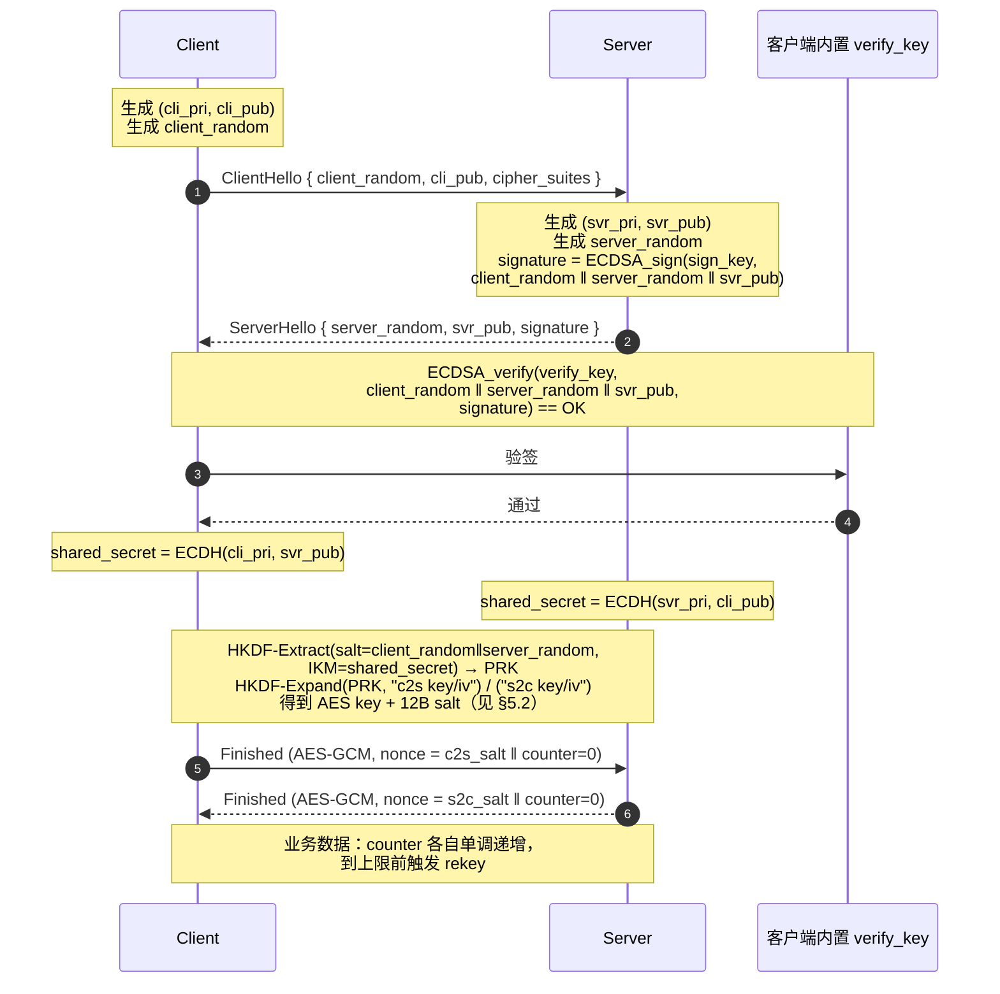

>原始笔记是几段没有标题的描述加两张截图，"坑"出现了两次，前后段落没有上下文衔接。这里按"配置疑似未生效 / NDK 版本坑 / 抓包结果 / 裁剪后同步 config"四块整理，原始代码与截图保持原样。

## 当前保留内容

### 1. CIPHER 配置疑似未生效

设置 `CURLOPT_SSLVERSION`（强制 TLS 1.2）和 `CURLOPT_SSL_CIPHER_LIST`（限定一组 ECDHE 套件）后，仍未达到预期，疑似未生效：

```
    CURLcode ret1;
    ret1 = curl_easy_setopt(curl_handle, CURLOPT_SSLVERSION,  CURL_SSLVERSION_TLSv1_2);
    if(ret1 != CURLE_OK)
    {
        MiLogE("request.url: CURLOPT_SSLVERSION failed ! ret = %d", ret1);
    }
   ret1 = curl_easy_setopt(curl_handle, CURLOPT_SSL_CIPHER_LIST,
                       // "TLS_ECDHE_ECDSA_WITH_CHACHA20_POLY1305_SHA256" ":"
                       // "TLS_ECDHE_ECDSA_WITH_AES_256_GCM_SHA384"
                       // "TLS-ECDHE-ECDSA-WITH-AES-256-GCM-SHA384"
                       "ECDHE-ECDSA-AES256-GCM-SHA384" ":"
                       "ECDHE-ECDSA-AES128-GCM-SHA256"
                        ":"
                       "ECDHE-ECDSA-AES256-SHA384"     ":"
                       "DHE-RSA-AES256-GCM-SHA384"     ":"
                       "ECDHE-RSA-AES256-GCM-SHA384"   ":"
                       "ECDHE-RSA-AES128-GCM-SHA256"   ":"
                       "ECDHE-ECDSA-AES128-SHA"        ":"
                       "ECDHE-ECDSA-AES128-SHA256"     ":"
                       "ECDHE-RSA-CHACHA20-POLY1305"   ":"
                       "ECDHE-RSA-AES256-SHA384"       ":"
                       "ECDHE-RSA-AES128-SHA256"       ":"
                       "ECDHE-ECDSA-CHACHA20-POLY1305" ":"
                       "ECDHE-ECDSA-AES256-SHA"        ":"
                       "ECDHE-RSA-AES128-SHA"          ":"
                       "DHE-RSA-AES128-GCM-SHA256"
                   );
   // curl_easy_setopt(curl_handle, CURLOPT_SSLVERSION,  CURL_SSLVERSION_TLSv1_1|CURL_SSLVERSION_TLSv1_2 |  CURL_SSLVERSION_TLSv1_3 | CURL_SSLVERSION_TLSv1 | CURL_SSLVERSION_SSLv2 | CURL_SSLVERSION_SSLv3);
   if(ret1 != CURLE_OK)
   {
       MiLogE("request.url:CURLOPT_SSL_CIPHER_LIST  ret = %d", ret1);
   }

    // curl_easy_setopt(curl_handle, CURLOPT_TLS13_CIPHERS,
    //                     // "TLS_ECDHE_ECDSA_WITH_CHACHA20_POLY1305_SHA256" ":"
    //                     // "TLS_ECDHE_ECDSA_WITH_AES_256_GCM_SHA384" 
    //                     "TLS-ECDHE-ECDSA-WITH-AES-256-GCM-SHA384"
    //                 );
```

### 2. Android NDK 版本坑

- Android NDK 版本：NDK 23 可用；NDK 25 / NDK 26 都遇到过问题（具体啥问题记录时已忘）。
- 实测换到低版本 NDK 后好使，但是没搞清高版本为什么不行。


可能的方向：clang 版本不同 → LTO 支持不同。低版本 NDK 可能不支持 LTO；Android LTO 还有一个坑——cxx link 阶段需要同时增加 `-flto`，否则会报：

```
file format not recognized
```

### 3. 抓包结果


### 4. 裁剪后的 mbedtls_config.h 同步

裁剪 mbedTLS 时，**记得同步修改 `mbedtls_config.h`**，否则编出来的库行为可能与预期不符。

### 5. AES key 与 IV 的设置策略

下面只讨论"对称会话密钥已经协商好"之后，如何安全地选取 IV / nonce。结论先放在前面：

- **AES key**：来自 ECDH/HKDF 的派生结果，长度按算法选 16 / 24 / 32 字节，整条会话内不变。
- **IV / nonce**：**绝不能复用**，不同模式有不同要求（见下表）。

#### 5.1 不同模式下 IV 的硬性要求

| 模式            | IV / nonce 长度 | 是否需要随机 | 是否可公开传输 | 重复使用的后果                            |
| --------------- | --------------- | ------------ | -------------- | ----------------------------------------- |
| AES-CBC         | 16 字节         | 必须不可预测 | 是             | 同 key 同 IV → 相同前缀的明文产生相同密文 |
| AES-CTR         | 16 字节（含计数器） | 唯一即可  | 是             | 同 (key, counter) → 直接异或泄漏明文      |
| AES-GCM         | 12 字节（推荐） | 唯一即可     | 是             | **同 (key, IV) 直接破坏认证密钥，灾难性** |
| AES-CCM         | 7~13 字节       | 唯一即可     | 是             | 同 GCM，认证强度被打穿                    |

#### 5.2 推荐策略（mbedTLS 调用层）

- **优先 AES-GCM-12B nonce**，构造方式 `nonce = 4B salt || 8B counter`：
  - `salt` 由握手期 HKDF 派生，双方各持自己方向的 salt；
  - `counter` 从 0 开始，每发一帧 `+1`，到达 2^64-1 之前必须重协商；
  - 这样能保证"同一 key 下 nonce 全局唯一"，且不需要随机源。
- **CBC 场景**用 `mbedtls_ctr_drbg_random()` 现取 16 字节作为 IV，**和密文一起传给对端**，不要从计数器派生（CBC 要求"不可预测"，单调计数器不满足）。
- **CTR 场景**把 IV 拆成 `8B nonce || 8B block_counter`，`nonce` 每条消息独立，`block_counter` 在加密块内自增。
- 任何模式下：**key 轮换**（rekey）触发条件 = 计数器接近上限 / 累计加密字节超过 2^36 / 会话超时，三者取最早。

#### 5.3 mbedTLS 调用要点

- 加密前用 `mbedtls_gcm_setkey()` 一次，之后每条消息只调用 `mbedtls_gcm_crypt_and_tag()` / `mbedtls_gcm_auth_decrypt()`，传入新的 nonce。
- 不要直接复用 `mbedtls_gcm_starts()` + `update()` + `finish()` 的中间状态——重置不彻底容易让前一条消息的 nonce/计数器残留。
- IV 不需要保密，但**必须保证完整性**：在 GCM 中 IV 已经被纳入 GHASH 计算，篡改即认证失败；在 CBC 中要靠外层 MAC（推荐 Encrypt-then-MAC）覆盖 IV。

### 6. ECDH 握手时序图

下面是与 mmtls / TLS 1.3 思路一致的"带服务端认证的 1-RTT ECDHE"握手时序，方便和上一节的 AES key 派生衔接。



如果 GitHub 没渲染 mermaid，可以读下面这份纯文本对照：

```
   Client                                      Server
     |                                            |
     | --- ClientHello (client_random, cli_pub) ->|
     |                                            |
     |                          生成 (svr_pri, svr_pub)
     |                          签名:
     |                            sig = sign(sign_key,
     |                                  client_random ||
     |                                  server_random ||
     |                                  svr_pub)
     | <-- ServerHello (server_random, svr_pub, sig) -|
     |                                            |
   verify(verify_key, ..., sig)                   |
   shared = ECDH(cli_pri, svr_pub)              shared = ECDH(svr_pri, cli_pub)
     |                                            |
     |  HKDF 派生:  c2s_key/c2s_salt, s2c_key/s2c_salt
     |                                            |
     | -- AES-GCM(c2s_key, c2s_salt||ctr++) ----->|
     | <- AES-GCM(s2c_key, s2c_salt||ctr++) ------|
     |                                            |
```

几个易错点：

- 签名内容**必须**包含 `client_random` 和 `server_random`，否则攻击者可以把一次握手的 `(svr_pub, sig)` 重放到另一次握手里（参见 mmtls 笔记中的"签名仅含 svr_pub_key 的隐患"）。
- `cli_pri / svr_pri` 是**临时**密钥对，每次握手新生成，握手完成后立即销毁——这是前向安全（PFS）的来源。
- HKDF 的 `salt` 用 `client_random ‖ server_random` 而不是常量，能避免不同会话派生出相同 PRK。
- 客户端做完 ECDH 之后立刻校验 `svr_pub` **不在小子群上**（X25519 由库内置处理；P-256 需要 `mbedtls_ecp_check_pubkey()`），否则会泄漏私钥。

## 后续可补的方向

- 把"CIPHER_LIST 疑似未生效"复盘到底是 curl 后端编译选项问题，还是 mbedTLS 端不支持这些套件
- 整理一张 NDK 版本 × clang 版本 × LTO 支持情况的对照表
- 把 §5 的 AES-GCM nonce 拼装方式写成一个最小 demo，对照 mbedTLS 的 `gcm_self_test` 跑一遍
- 在 §6 时序图基础上补 0-RTT PSK 与 0-RTT PSK-ECDHE 两种变体，与主站 mmtls 笔记对齐
